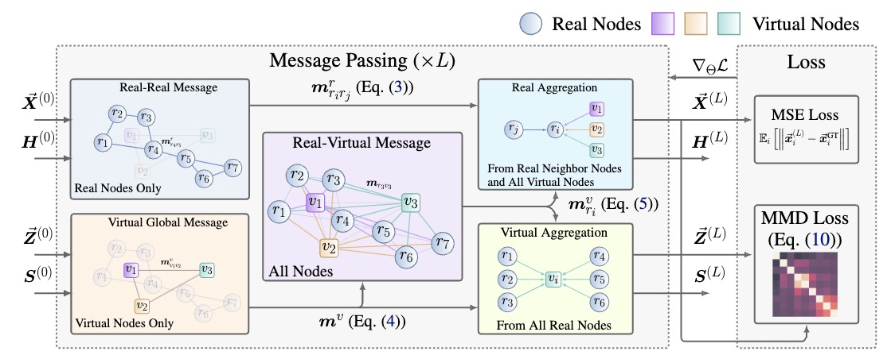

# [ICML24] Improving Equivariant Graph Neural Networks on Large Geometric Graphs via Virtual Nodes Learning

[](./assets/FastEGNN.pdf) 



## Setup:

```bash
pip install -r requirements.txt
```

## Run Experiments

Before executing following shell, please make sure that you specify the right `data_directory` and `log_directory` based on your machine. After the Training and Evaluating Ends, a log file will be generated in the log_directory, containing args, and losses.

**1. N-body System Dataset**

Data Generation:

```bash
cd ./datasets/nbody/datagen
bash run.sh
cd ../../..
```

Train and Evaluate Model:

```bash
bash run_nbody.sh
```

**2. Protein Molecular Dynamics Dataset**

Train and Evaluate Model:

```bash
bash run_protein.sh
```

The Dataset will automatically download in the directory you specified.

**3. Water-3D Dataset**

Follow the instruction introduced [here](https://github.com/tumaer/lagrangebench/tree/main/gns_data) to download the .tfrecord format Water-3D data and transform them to .h5. Place the .h5 format data in your data directory.

Train and Evaluate Model:

```bash
bash run_simulation.sh
```

**4. QM9 Dataset**

Download this dataset from [link](https://springernature.figshare.com/ndownloader/files/3195389) and place it in your data directory.

Train and Evaluate Model:

```bash
bash run_simulation.sh
```


## Equivariant Test

```bash
python equivariant.py
```

It will random generate a graph `G`, rotation matrix `R` and translation vector `t`, and check `FastEGNN(G @ R + t)` equals to `FastEGNN(G) @ R + t` or not.
   

## Citation

If you find our work helpful, please cite as:

```
@inproceedings{
    zhang2024improving,
    title={Improving Equivariant Graph Neural Networks on Large Geometric Graphs  via Virtual Nodes Learning},
    author={Yuelin Zhang and Jiacheng Cen and Jiaqi Han and Zhiqiang Zhang and JUN ZHOU and Wenbing Huang},
    booktitle={Forty-first International Conference on Machine Learning},
    year={2024},
    url={https://openreview.net/forum?id=wWdkNkUY8k}
}
```

